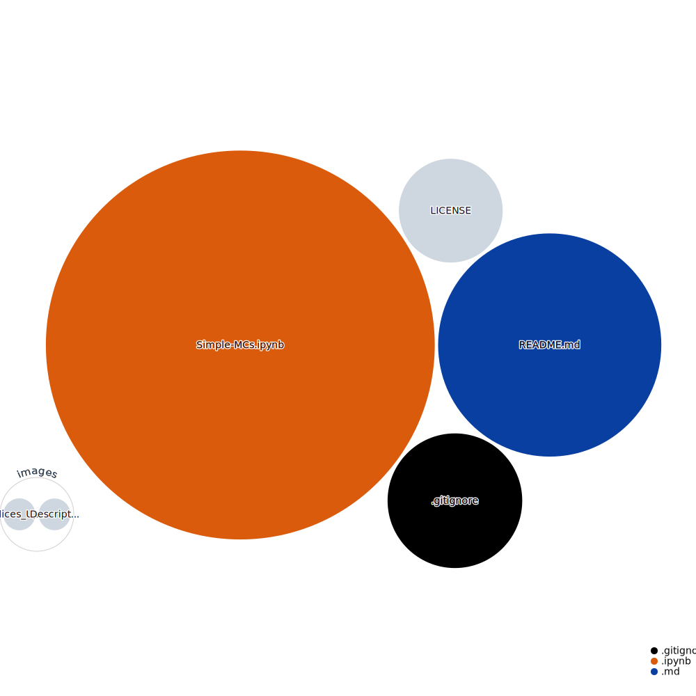

## MonteCarlo Exercises  

 <i>Repository Tools:</i> 

##### Actions:  
##### Main Text-Editor:  &nbsp;
##### Language:  
##### Libraries:    
##### Interface:  
##### Version Control:    

##### License:&nbsp;

 <i>Contact:</i> 

   

  

 

 <i>Repository Visualization:</i> 

  
 

### Description:
In this repository the following exercises are solved using Montecarlo <i>(see nbviewer → repo visualization)</i>.
- 1° ~ The chance of winning at a game in a Casino involving 3 dices where the last 2 are loaded. 
Equiprobable events for $d_{1}$ and a Binomial distribution for $d_{(2,3)}$ (given parameters): 
$d_1 \sim U(a,b)$, $d_{(2,3)} \sim B(n,p)$.  
- 2° ~ Cafeteria sales for $T=7h$ per day from $d_{1,2...5}$. 
Insights of the clients and their behavior based on $N =10000$ simulations with given data: 
$Wait_{time_{w,m}} = (5s-30s, 5s-30s)$: 
$Attention_{time_{w,m}} = (60s-300s, 40s-120s)$, 
$Buy_{min, max_{w,m}}= (30-100, 20-80)$, 
$x~\sim~U(0,1)$ is assumed. 

###### **References:**
[`numpy.random.uniform`](https://numpy.org/doc/stable/reference/random/index.html)